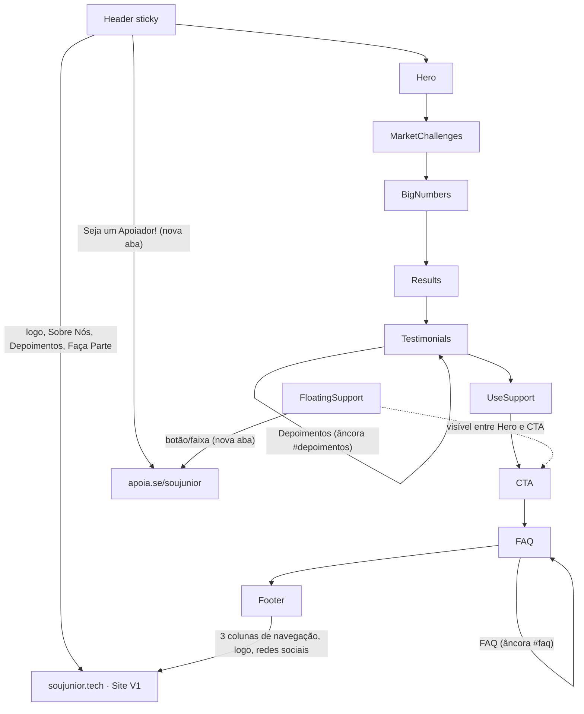

# hackathon-web-wizard

Landing page "Seja um Apoiador" da SouJunior. Página satélite, fora do site principal (V1), criada para concentrar a jornada de doação/apoio em um único fluxo, com header e footer que redirecionam de volta para as páginas e seções relevantes do site oficial.

## Sumário

- [Stack](#stack)
- [Equipe](#equipe)
- [Pré-requisitos](#pré-requisitos)
- [Rodando o projeto](#rodando-o-projeto)
- [Estrutura do projeto](#estrutura-do-projeto)
- [Fluxo da página](#fluxo-da-página)
- [Links externos (site V1)](#links-externos-site-v1)
- [Vídeo de depoimento (hospedagem externa)](#vídeo-de-depoimento-hospedagem-externa)
- [Acessibilidade](#acessibilidade)
- [Padrões do projeto](#padrões-do-projeto)

- [Como contribuir](#como-contribuir)

## Stack

- [React 19](https://react.dev/)
- [TypeScript](https://www.typescriptlang.org/)
- [Vite](https://vite.dev/) (dev server e build)
- [styled-components](https://styled-components.com/) (estilização)
- [react-router-dom](https://reactrouter.com/) (roteamento interno, usado pelo `BrowserRouter` e pelos links de âncora dentro da própria página)
- [typeit-react](https://www.npmjs.com/package/typeit-react) (animação de texto digitado na seção BigNumbers)

## Pré-requisitos

- Node.js 20+
- Yarn (gerenciador de pacotes do projeto — não usar `npm install`, o `package-lock.json` não é versionado)

## Rodando o projeto

```bash
yarn install
yarn dev
```

O servidor de desenvolvimento sobe em `http://localhost:5173` (ou a próxima porta livre).

### Scripts disponíveis

| Script         | O que faz                                 |
| -------------- | ----------------------------------------- |
| `yarn dev`     | Sobe o servidor de desenvolvimento (Vite) |
| `yarn build`   | Type-check (`tsc -b`) + build de produção |
| `yarn preview` | Serve o build de produção localmente      |
| `yarn lint`    | Roda o ESLint no projeto                  |
| `yarn test`    | Roda os testes (Vitest)                   |

## Estrutura do projeto

```
src/
├── App.tsx                  # Entry point da árvore de components
├── main.tsx                 # Bootstrap: StrictMode + BrowserRouter + GlobalStyle
├── components/
│   ├── header/               # Header sticky, links do menu e CTA "Seja um Apoiador"
│   ├── footer/                # Footer com navegação em 3 colunas e redes sociais
│   ├── FloatingSupport/        # Botão flutuante (desktop) / faixa fixa (mobile) de apoio
│   ├── common/
│   │   ├── link/               # Link único: detecta externo (http) vs interno e trata target/rel
│   │   └── image/               # Wrapper de 
│   ├── ServiceCard/           # Card usado na seção "Para onde vai o seu apoio?"
│   ├── ChallengeCard/          # Card usado na seção "Desafios do Mercado"
│   └── Button/                 # Botão de CTA usado na Hero/CTA
├── pages/
│   └── Home/
│       ├── index.tsx            # Composição da página, ordem das seções abaixo
│       └── sections/
│           ├── Hero/              # Seção de abertura
│           ├── MarketChallenges/   # "Hoje o mercado enfrenta dois desafios" (id market-challenges)
│           ├── BigNumbers/          # Números/animação de áreas que migraram pra tech
│           ├── Results/              # Estatísticas de voluntários
│           ├── Testimonials/          # Depoimentos, carrossel com vídeo (âncora #depoimentos)
│           ├── UseSupport/             # "Para onde vai o seu apoio?"
│           ├── CTA/                     # "Doe R$ 2,00" (id cta)
│           └── FAQ/                      # Perguntas frequentes (âncora #faq)
├── utils/
│   ├── headerLinks.ts         # Dados dos links do header + URL de apoio
│   └── footerLinks.ts          # Dados das 3 colunas do footer + redes sociais
├── styles/
│   ├── colorPalette.ts         # Paleta de cores compartilhada
│   └── global.ts                # Estilos globais e tipografia base
└── assets/                    # Logos, ícones sociais, fotos de depoimentos, ilustrações
```

## Fluxo da página



`FloatingSupport` acompanha o scroll: aparece perto do fim da Hero e some ao alcançar o CTA, tanto descendo quanto subindo a página. No desktop é um botão circular flutuante; no mobile, uma faixa fixa no rodapé da tela.

## Links externos (site V1)

O header e o footer não navegam dentro dessa página, eles direcionam de volta para o site institucional da SouJunior (V1, em `soujunior.tech`) e para a campanha de apoio no Apoia.se. Isso é intencional: essa página é um satélite focado em conversão, não uma réplica completa do site.

- Logo e itens de menu do header/footer → `soujunior.tech` (mesma aba).
- Botão "Seja um Apoiador!" e a coluna "Faça Parte" do footer → `apoia.se/soujunior` (nova aba).
- Redes sociais do footer → perfis oficiais da SouJunior (nova aba).
- Link "Faça Parte" do header → plataforma Stars (`stars.soujunior.tech`, nova aba).
- Link dentro da 2ª pergunta do FAQ → formulário de apoio não financeiro da V1 (`soujunior.tech/apoiar`, nova aba).

Os destinos exatos de cada link vivem em `src/utils/headerLinks.ts` e `src/utils/footerLinks.ts`, centralizados para facilitar atualização quando o site V1 mudar de estrutura.

## Vídeo de depoimento (hospedagem externa)

O vídeo do depoimento em vídeo (seção Testimonials) não fica no repositório. O
arquivo original tinha 118MB (acima do limite de 100MB do GitHub), foi
comprimido para ~21MB e depois movido para o Supabase Storage, referenciado
só por URL em `src/pages/Home/sections/Testimonials/TestimonialsData.ts`
(campo `videoSrc`).

⚠️ A URL atual é **assinada** (contém um token com expiração em 2028), não é
um link público permanente. Antes de virar produção de verdade, trocar o
bucket do Supabase para **público** e atualizar `videoSrc` para a URL sem
token — assim o link para de depender de renovação futura.

## Acessibilidade

Não é uma implementação completa de WCAG, mas o header e o footer seguem o básico:

- `aria-label` na navegação principal (`<nav>`) e no botão de menu mobile, com `aria-expanded` refletindo o estado aberto/fechado.
- `alt` descritivo nas imagens (logo, ícones sociais).
- Logo com `role="img"` quando é um wrapper de link em volta da imagem.
- Links externos com `rel="noopener noreferrer"`, evitando que a nova aba tenha acesso à página de origem via `window.opener`.

## Padrões do projeto

- Components exportados de forma nomeada (`export function X`), sem `export default`.
- Arquivo de estilo por component: `style.ts` (styled-components).
- Link externo (`http...`) sempre com `target="_blank" rel="noopener noreferrer"`; link interno usa `react-router-dom`.
- Hooks de commit (Husky + lint-staged) rodam Prettier e ESLint automaticamente em cada commit.

## Equipe

Squad Web Wizards, hackathon SouJunior.

| Nome                       | Papel na Squad | LinkedIn                                                                                        |
| -------------------------- | -------------- | ----------------------------------------------------------------------------------------------- |
| Douglas Felipe             | Produto (APM)  | [linkedin.com/in/douglas-felipe-da-costa](https://www.linkedin.com/in/douglas-felipe-da-costa/) |
| Gabriel Bruder             | Produto (APM)  | [linkedin.com/in/gabrielbruder](https://www.linkedin.com/in/gabrielbruder)                      |
| Lucas Maia                 | Agilista       | [linkedin.com/in/lucas-maia-5bb52b205](https://www.linkedin.com/in/lucas-maia-5bb52b205/)       |
| Marcos Oliveira da Silva   | Mentor Dev     | [linkedin.com/in/marcosoliveirassilva](https://www.linkedin.com/in/marcosoliveirassilva/)       |
| Milene Gomes               | Qualidade (QA) | [linkedin.com/in/milene-azevedo-gomes](https://www.linkedin.com/in/milene-azevedo-gomes/)       |
| Natália Pires              | UX/UI Designer | [linkedin.com/in/nataliapiress](https://www.linkedin.com/in/nataliapiress/)                     |
| Renan Queiroz Eliziario    | Dev            | [linkedin.com/in/renaneliziario](https://www.linkedin.com/in/renaneliziario/)                   |
| Thiago Guimarães           | UX/UI Designer | [linkedin.com/in/thiagoguimaraespe](https://www.linkedin.com/in/thiagoguimaraespe/)             |
| Vania Tavares              | Qualidade (QA) | [linkedin.com/in/vania-dph](https://www.linkedin.com/in/vania-dph/)                             |
| Vanilo dos Santos Ferreira | Dev            | [linkedin.com/in/vanilo-ferreira](https://www.linkedin.com/in/vanilo-ferreira/)                 |

## Como contribuir

```bash
# 1. Crie uma branch a partir da main
git checkout -b feat/nome-da-mudanca

# 2. Faça suas alterações e valide localmente
yarn lint
yarn build

# 3. Commit seguindo Conventional Commits
git commit -m "feat: adiciona nova seção X"

# 4. Suba a branch e abra um Pull Request para a main
git push -u origin feat/nome-da-mudanca
```

Tipos de commit usados no projeto: `feat`, `fix`, `chore`, `docs`. O pre-commit hook (Husky) já roda Prettier e ESLint automaticamente, não precisa formatar na mão.
