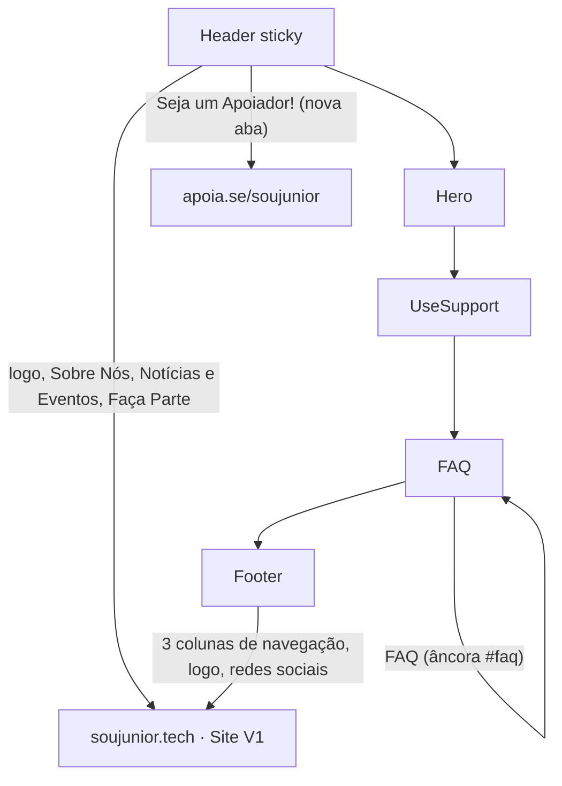

# hackathon-web-wizard

Landing page "Seja um Apoiador" da SouJunior. Página satélite, fora do site principal (V1), criada para concentrar a jornada de doação/apoio em um único fluxo, com header e footer que redirecionam de volta para as páginas e seções relevantes do site oficial.

## Stack

- [React 19](https://react.dev/)
- [TypeScript](https://www.typescriptlang.org/)
- [Vite](https://vite.dev/) (dev server e build)
- [styled-components](https://styled-components.com/) (estilização)
- [react-router-dom](https://reactrouter.com/) (roteamento interno, usado pelo `BrowserRouter` e pelos links de âncora dentro da própria página)

## Pré-requisitos

- Node.js 20+
- Yarn (gerenciador de pacotes do projeto — não usar `npm install`, o `package-lock.json` não é versionado)

## Rodando o projeto

```bash
yarn install
yarn dev
```

O servidor de desenvolvimento sobe em `http://localhost:5173` (ou a próxima porta livre).

### Scripts disponíveis

| Script         | O que faz                                 |
| -------------- | ----------------------------------------- |
| `yarn dev`     | Sobe o servidor de desenvolvimento (Vite) |
| `yarn build`   | Type-check (`tsc -b`) + build de produção |
| `yarn preview` | Serve o build de produção localmente      |
| `yarn lint`    | Roda o ESLint no projeto                  |
| `yarn test`    | Roda os testes (Vitest)                   |

## Estrutura do projeto

```
src/
├── App.tsx                  # Entry point da árvore de components
├── main.tsx                 # Bootstrap: StrictMode + BrowserRouter + GlobalStyle
├── components/
│   ├── header/               # Header sticky, links do menu e CTA "Seja um Apoiador"
│   ├── footer/                # Footer com navegação em 3 colunas e redes sociais
│   ├── common/
│   │   ├── link/               # Link único: detecta externo (http) vs interno e trata target/rel
│   │   └── image/               # Wrapper de 
│   ├── ServiceCard/           # Card usado na seção de serviços/áreas de apoio
│   └── Button/                 # Botão de CTA usado na Hero
├── pages/
│   └── Home/
│       ├── index.tsx            # Composição da página: Header, Hero, UseSupport, FAQ, Footer
│       └── sections/
│           ├── Hero/              # Seção de abertura
│           ├── UseSupport/         # Áreas em que a SouJunior atua
│           └── FAQ/                 # Perguntas frequentes (âncora #faq)
├── utils/
│   ├── headerLinks.ts         # Dados dos links do header + URL de apoio
│   └── footerLinks.ts          # Dados das 3 colunas do footer + redes sociais
├── styles/
│   ├── colorPalette.ts         # Paleta de cores compartilhada
│   └── global.ts                # Estilos globais e tipografia base
└── assets/                    # Logos, ícones sociais, ilustrações
```

## Fluxo da página



## Links externos (site V1)

O header e o footer não navegam dentro dessa página, eles direcionam de volta para o site institucional da SouJunior (V1, em `soujunior.tech`) e para a campanha de apoio no Apoia.se. Isso é intencional: essa página é um satélite focado em conversão, não uma réplica completa do site.

- Logo e itens de menu do header/footer → `soujunior.tech` (mesma aba).
- Botão "Seja um Apoiador!" e a coluna "Faça Parte" do footer → `apoia.se/soujunior` (nova aba).
- Redes sociais do footer → perfis oficiais da SouJunior (nova aba).

Os destinos exatos de cada link vivem em `src/utils/headerLinks.ts` e `src/utils/footerLinks.ts`, centralizados para facilitar atualização quando o site V1 mudar de estrutura.

## Padrões do projeto

- Components exportados de forma nomeada (`export function X`), sem `export default`.
- Arquivo de estilo por component: `style.ts` (styled-components).
- Link externo (`http...`) sempre com `target="_blank" rel="noopener noreferrer"`; link interno usa `react-router-dom`.
- Hooks de commit (Husky + lint-staged) rodam Prettier e ESLint automaticamente em cada commit.
